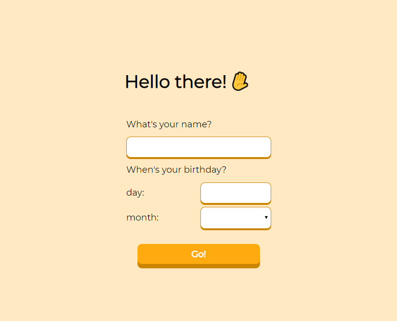
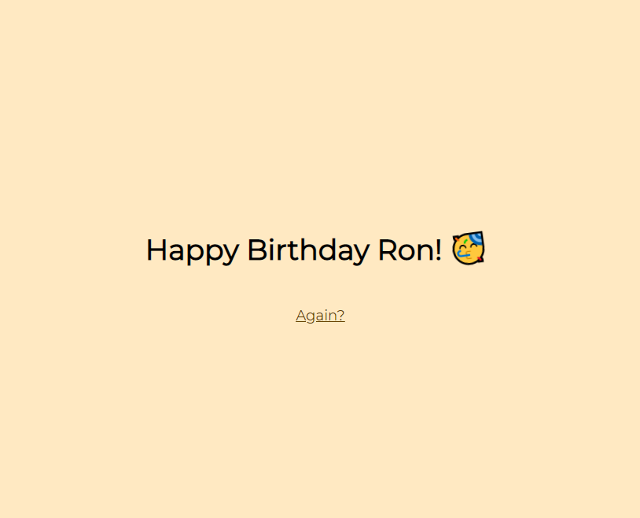
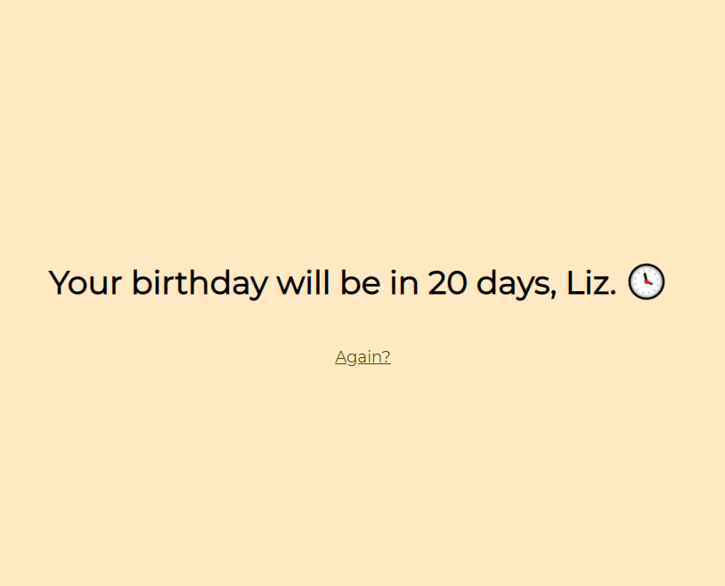

# Birthday Greeter App

A small project to practice using Sinatra, MVC, handling HTTP response/request cycle, and HTML/CSS.

## Instructions

- Install dependencies from the main directory with:

```bash
bundle
```

- Run the server from the main directory with:

```bash
ruby birthday_app.rb
```

- Head to <http://localhost:4567> and check it out!

## Previews

The main screen:



If today is your birthday:



If today is not your birthday:

